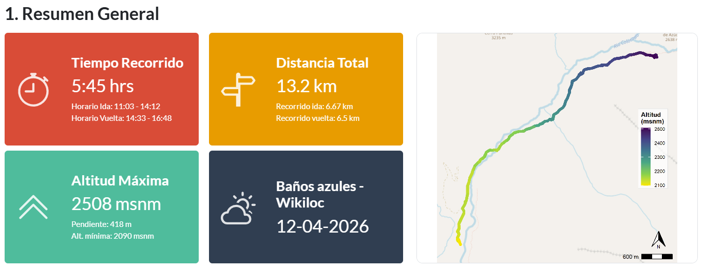
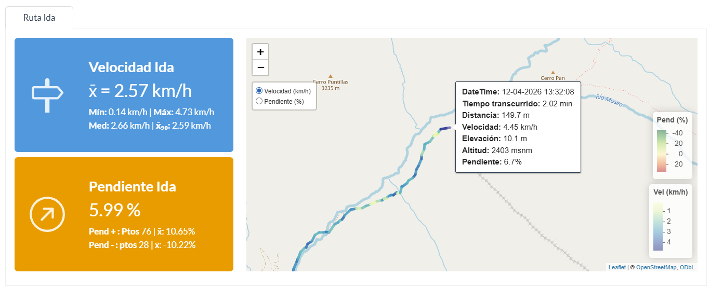
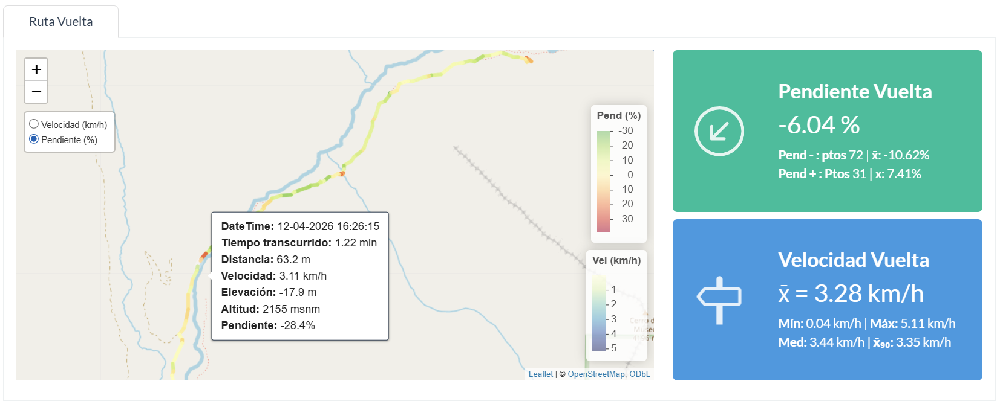

# Performance Hiking Trail: Dashboard Baños Azules 🏔️🥾

Este proyecto es un **Dashboard Interactivo de Rendimiento Deportivo** desarrollado en **Quarto (`.qmd`)** enfocado en el análisis espacial y temporal de la ruta de senderismo de alta montaña hacia **Baños Azules**, Chile. 

> ⚠️ **REQUISITO CRÍTICO DE VISUALIZACIÓN:** Este dashboard ha sido diseñado exclusivamente para entornos de análisis en estaciones de trabajo fijas y **no es responsivo** (no cuenta con soporte autoajustable para dispositivos móviles o pantallas divididas). Para garantizar una correcta visualizacion, se requiere obligatoriamente un **ancho de pantalla mínimo de 1200px** (resolución estándar de notebooks de 13" o monitores de escritorio).
>
> Acceso al reporte [dashboard HTML](https://sarudalf3.github.io/Dashboard_trail/)
>
>

-----

El objetivo principal es procesar archivos de posicionamiento global (`.gpx`), estructurar métricas analíticas avanzadas de velocidad, altitud y pendientes geográficas, y presentarlas visualmente para evaluar el desempeño físico tramo a tramo.

-----

## 📊 Información del Dashboard

El panel está estructurado estratégicamente en secciones dinámicas e independientes para facilitar el análisis del trekking:

### 1. Resumen General

Esta sección consolida las métricas macro de la travesía mediante indicadores de alto impacto visual (`value_boxes` personalizados).
Permite evaluar rápidamente la distancia acumulada, altitudes extremas, desniveles totales y el tiempo neto de marcha. Además, incluye un gráfico de perfil de elevación detallado desarrollado en `ggplot2`, ideal para identificar visualmente la exigencia del terreno.

### 2. Mapas Interactivos de Trayecto (Ida y Vuelta)

La sección de trayectos está separada mediante pestañas interactivas que dividen analíticamente la experiencia de **Ida (Ascenso)** y **Vuelta (Descenso)**. 

Ambas pestañas integran un **Mapa Cartográfico Interactivo (`leaflet`)** que dibuja la traza del GPS. El mapa cuenta con control de capas para alternar la visualización entre la **Velocidad en tiempo real (km/h)** y el **Grado de Inclinación o Pendiente (%)**, equipado además con un *tooltip* de gran tamaño y respuesta *hover* optimizada para una lectura ultra precisa de cada coordenada.

- **Ida:** Enfocada en la exigencia física. Incorpora subsecciones que desglosan la velocidad promedio (global, mínima, máxima, mediana y promedio recortado al 90% $x̄_{90}$) y un análisis exhaustivo de pendientes segregando la cantidad de puntos de ascenso frente a falsos llanos o pequeños descansos en la subida.
  

- **Vuelta:** Ajustada al ritmo de retorno y descenso. Configurada con paletas visuales e íconos específicos que contrastan con la ida, permitiendo medir los tramos técnicos de bajada rápida.
  

- **Indicadores:** Fórmula de métricas calculadas en el dashboard.
  

------------------------------------------------------------------------

## 🛠️ Herramientas y Stack Tecnológico

El proyecto se construyó íntegramente bajo el ecosistema estadístico
**R** y la suite de publicación científica **Quarto**, utilizando las
siguientes librerías especializadas:

-   **`sf` (Simple Features):** Procesamiento de datos vectoriales y
    manipulación de la geometría geoespacial del archivo GPX.
-   **`leaflet`:** Motor de renderizado cartográfico interactivo basado
    en JavaScript para visualización en navegador.
-   **`bslib` & `bsicons`:** Diseño de la interfaz de usuario de
    Dashboard, componentes de contenedores de tarjetas, cuadrículas
    jerárquicas y fuentes de iconos Bootstrap.
-   **`tidyverse` (`ggplot2`, `dplyr`, `lubridate`, `purrr`):**
    Manipulación de series temporales, limpieza de datos, cálculo de
    promedios recortados, segmentación de trayectos y diseño del perfil
    topográfico estático.
-   **`htmltools`:** Inyección de fragmentos de código HTML estructurado
    y estilos en línea CSS personalizados para las cajas de control de
    métricas.
-   **`paletteer`:** Gestión avanzada de paletas de color con alto
    contraste estructural para las variables del mapa.
-   **`ggspatial` & `units`:** Soporte de escalas espaciales y
    normalización de variables métricas de distancia y altitud.

------------------------------------------------------------------------

## 🖥️ Requerimientos del Sistema y Visualización

### ⚠️ Limitación Crítica de Visualización (Layout No Responsivo)

Este dashboard ha sido diseñado exclusivamente para entornos de análisis profesional en estaciones de trabajo fijas. **El diseño no es responsivo (No cuenta con soporte autoajustable para dispositivos móviles, tablets o pantallas divididas)**.

 **Visualización:** Se recomienda
abrir el archivo HTML generado  en el navegador
web de su preferencia (Chrome, Edge, Firefox, Safari) y mantener el nivel de zoom al 90%.

### Dependencias para la Compilación local

Para compilar y ejecutar este dashboard de forma local, es necesario
disponer de:

1\. **R** v4.2 o superior.

2\. **Quarto CLI** instalado en el sistema operativo o integrado
mediante **RStudio IDE**.

3\. Todas las librerías mencionadas en la sección de herramientas
instaladas ejecutando: text?code_stdout&code_event_index=2 Archivo
README.md generado de manera exitosa.

`r     install.packages(c("sf", "tidyverse", "leaflet", "bslib", "htmltools", "bsicons", "lubridate", "paletteer", "ggspatial", "units"))`

4\. Contar con el archivo de traza satelital `banos_azules.gpx` ubicado
exactamente en la raíz del directorio de trabajo.

Para compilar el panel ejecute en terminal: \`\`\`bash quarto render
dash_draft.qmd

Desarrollado con fines de optimización analítica en rutas de trekking de alta montaña. 🏔️